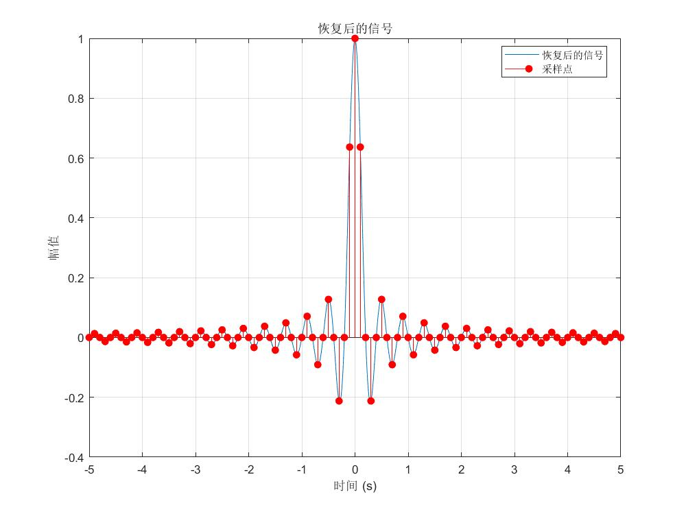

### 1. 清除工作区和命令窗口

- **功能** ：使用 `clear` 命令清除工作区中的变量，`clc` 命令清空命令窗口的内容，为后续的程序运行创建一个干净、无干扰的环境。

### 2. 定义输入信号

- **时间向量生成** ：`t = linspace(-5, 5, 1000)` 在时间范围 - 5 到 5 之间生成 1000 个均匀分布的时间点，用于后续信号的时域表示。
- **原始信号生成** ：`x = sinc(5 * t)` 利用 sinc 函数（其定义通常为 `sin(πx)/(πx)`）与时间向量相乘生成原始输入信号 x。
- **频移信号生成** ：`x_trans = sinc(5 * t) + exp(-100i * t) .* sinc(5 * t) + exp(100i * t) .* sinc(5 * t)` 通过将原始信号与复指数信号相乘，对原始信号进行频移，生成新的信号 x_trans，使信号包含原始频率以及 ±100 的频移频率成分。
- **获取信号长度** ：`N = length(x_trans)` 计算频移后信号 x_trans 的长度，为后续的傅里叶变换等操作提供数据维度信息。

### 3. 对信号进行傅里叶变换

- **功能** ：`X = fftshift(fft(x_trans))` 对频移后的信号 x_trans 进行快速傅里叶变换（FFT），并将变换后的频谱进行 fftshift 操作，使零频分量位于频谱中心，便于频域分析。

### 4. 绘制输入信号和傅里叶变换结果

- **创建图形窗口** ：`figure('Name', '输入信号和傅里叶变换', 'Position', [100, 100, 1000, 800])` 创建一个新的图形窗口，指定窗口名称和位置大小，用于展示输入信号的时域波形和傅里叶变换后的频域结果。
- **原始信号时域波形绘制** ：`subplot(2, 2, 1)` 创建 2 行 2 列的子图布局，选择第一个子图位置，`plot(t, x)` 绘制原始输入信号 x 的时域波形，`title`、`xlabel`、`ylabel` 分别设置子图的标题、x 轴和 y 轴标签，`grid on` 添加网格便于观察。
- **频移后信号时域波形绘制** ：在第二个子图位置绘制频移后的信号 x_trans 的时域波形，由于 x_trans 可能包含虚部，使用 `real(x_trans)` 取其实部进行绘制。
- **频率向量定义** ：计算采样频率 `fs = 1 / (t(2) - t(1))` ，然后利用 `f = linspace(-fs/2, fs/2, N)` 定义频率向量，用于频域显示的横坐标。
- **原始信号频域幅度谱绘制** ：在第三个子图位置，先对原始信号 x 进行傅里叶变换并归一化 `XX = fftshift(fft(x)) / N`，然后 `plot(f, abs(XX))` 绘制原始信号的频域幅度谱，展示信号在不同频率上的幅值分布。
- **频移后信号频域幅度谱绘制** ：在第四个子图位置绘制频移后信号 x_trans 的频域幅度谱，直观呈现频移操作对信号频谱的影响。

### 5. 设计并应用低通滤波器

- **设置滤波器参数** ：设定低通滤波器的截止频率 `fc = 5` Hz 和滤波器阶数 `order = 50`，截止频率决定了滤波器允许低频信号通过的最高频率，阶数影响滤波器的选择性和过渡带宽度。
- **生成滤波器系数** ：`b = fir1(order, fc / (fs / 2))` 使用 fir1 函数生成低通滤波器的系数，其中将截止频率归一化到 Nyquist 频率（采样频率的一半，即 `fs/2`）。
- **滤波操作** ：`y = filter(b, 1, x_trans)` 将设计好的低通滤波器应用于频移后的信号 x_trans，得到滤波后的信号 y，滤除信号中高于截止频率的高频成分（包括部分频移产生的高频成分）。
- **滤波后信号的傅里叶变换** ：`Y = fftshift(fft(y))` 对滤波后的信号 y 进行傅里叶变换并移频，用于后续分析滤波对信号频谱的影响。

### 6. 绘制输入输出信号及其傅里叶变换结果

- **创建图形窗口** ：`figure('Name', '输入输出信号及其傅里叶变换', 'Position', [100, 100, 1000, 800])` 创建新窗口展示原始信号和滤波后信号的时域波形及其傅里叶变换结果。
- **原始信号时域波形绘制** ：在第一个子图位置绘制原始信号 x_trans 的时域波形（取实部）。
- **滤波后信号时域波形绘制** ：在第二个子图位置绘制滤波后的信号 y 的时域波形（取实部），对比观察滤波对信号时域形态的改变。
- **原始信号频域幅度谱绘制** ：在第三个子图位置绘制原始信号 x_trans 的频域幅度谱，展示滤波前信号的频率成分。
- **滤波后信号频域幅度谱绘制** ：在第四个子图位置绘制滤波后信号 y 的频域幅度谱，体现滤波器对信号频谱的滤波效果，即保留低频成分，衰减高频成分。

### 7. 绘制滤波器的频率响应

- **功能** ：`freqz(b, 1, 512, fs)` 绘制滤波器的频率响应特性曲线，指定采样频率 fs，`title`、`xlabel`、`ylabel` 等设置图形的标题和坐标轴标签，直观呈现滤波器在不同频率下的幅值响应（以 dB 为单位）和相位响应等特性，帮助评估滤波器的性能。

### 8. 调制和解调过程

- **调制部分** ：
  - **设置载波频率** ：`fc = 20000` Hz，确定调制所使用的正弦载波信号的频率。
  - **生成载波信号** ：`c = sin(2 * pi * fc * t)` 根据载波频率和时间向量生成正弦载波单位冲激函数波信号。
  - **调制操作** ：`m = real(y) .* c` 将滤波后的信号 y（取实部）与载波信号 c 相乘，完成对信号的调制，得到调制后的信号 m，将基带信号搬移到以载波频率为中心的高频段，便于信号的传输。
- **调制信号绘制** ：创建新窗口展示调制前后的信号及其频谱，包括调制前信号（滤波后的信号）的时域波形和频域幅度谱、调制后信号 m 的时域波形和频域幅度谱，通过对比可观察调制过程对信号频谱位置的改变。
- **解调部分** ：
  - **解调操作** ：`y_demod = m .* sin(2 * pi * fc * t)` 对调制后的信号 m 与相同的载波信号相乘进行解调，将信号搬移回低频段，但由于混频会产生多个频率成分，包括原基带信号频率以及与载波频率相关的其他频率成分。
  - **进一步处理** ：`baseband_sig = y_demod .* sin(2 * pi * fc * t)` 再次与载波信号相乘，对解调后的信号进行进一步处理，可能会产生更多的频率成分，但目的是尝试恢复出原始的基带信号信息。
  - **计算包络** ：`envelope = abs(hilbert(baseband_sig))` 利用希尔伯特变换计算解调后信号的包络，包络反映了信号的幅度变化特征。
  - **滤波操作** ：`[b_filt, a_filt] = butter(6, 0.5, 'low')` 设计一个六阶低通巴特沃斯滤波器，截止频率为 0.5（归一化频率），`z = filter(b_filt, a_filt, y_demod)` 对解调后的信号进行滤波，去除高频干扰成分，得到更接近原始基带信号的滤波后信号 z。
- **解调信号绘制** ：创建新窗口展示解调解调前后的信号和频谱，包括解调前的信号（调制后信号 m）的时域波形和频域幅度谱、解调后的信号的时域波形和频域幅度谱、滤波后信号 z 的频域幅度谱，用于分析解调和滤波过程对信号恢复的效果。

### 9. 拉普拉斯变换

- **功能** ：`syms s t` 定义符号变量 s 和 t，`laplace_x = laplace(sinc(5*t), t, s)` 对 sinc(5*t) 进行拉普拉斯变换，得到其在复频域的表达式 laplace_x。
- **绘制拉普拉斯变换幅度谱** ：`figure('Name', '拉普拉斯变换')` 创建新窗口，`ezplot(abs(laplace_x), [0, 100])` 绘制拉普拉斯变换结果的幅度谱，限定复频率范围在 0 到 100 之间，展示信号在复频域的幅度分布情况，拉普拉斯变换主要用于分析连续时间信号和系统的复频域特性，比傅里叶变换的应用范围更广泛，可处理包含指数增长或衰减成分的信号。

### 10. 信号采样与 Z 变换

- **采样设置** ：设定采样频率 `fs_sample = 10` Hz，根据该频率生成采样时间点 `t_sample = -5 : 1 / fs_sample : 5`，这些时间点用于对原始信号进行采样。
- **信号采样** ：`x_sampled = sinc(5 * t_sample)` 根据采样时间点提取原始信号 sinc(5*t) 在这些时刻的样本值，得到采样信号 x_sampled，模拟了信号的离散化过程。
- **绘制采样信号时域波形** ：创建新窗口，使用 `stem` 函数绘制采样信号的时域波形，`filled` 参数使茎线的圆圈填充颜色，直观展示采样点的位置和幅值。

### 11. 计算 Z 变换并绘制幅度谱

- **定义离散时间信号** ：`n = -5 * fs_sample : 5 * fs_sample` 定义离散时间序列的索引范围，`x_n = sinc(5 * (n / fs_sample))` 根据采样后的离散时间计算对应的信号值，得到离散时间信号 x_n。
- **计算 Z 变换频率响应** ：设定 FFT 点数 `N_fft = 1000`，`X_z = fftshift(abs(fft(x_n, N_fft)))` 使用指定的 FFT 点数计算离散时间信号的 Z 变换的幅度谱，并进行 fftshift 操作使频率轴对称，Z 变换是分析离散时间信号和系统的有力工具，与傅里叶变换有密切关系，但 Z 变换在复频域平面上进行分析。
- **定义数字频率向量** ：`w = linspace(0, pi, N_fft)` 定义数字频率范围，采用归一化频率（以 π 为单位），长度与 FFT 点数一致，用于频域横坐标。
- **绘制 Z 变换幅度谱** ：创建新窗口，`plot(w / pi, X_z)` 绘制 Z 变换结果的幅度谱，横坐标为归一化频率（乘以 π），纵坐标为幅值，展示离散信号在数字频域的幅度分布情况。

### 12. 信号恢复

- **定义恢复时间范围** ：`t_recovered = linspace(-5, 5, 1000)` 定义与原始信号相同时间范围的恢复时间向量，用于信号恢复后的时域表示，包含 1000 个时间点。
- **信号恢复与插值** ：`x_recovered = interp1(t_sample, x_sampled, t_recovered, 'spline')` 使用样条插值方法，根据采样点时间 t_sample 和采样信号 x_sampled，对恢复时间向量 t_recovered 进行插值，得到恢复后的信号 x_recovered，模拟了通过采样点重建连续信号的过程。
- **绘制恢复后信号** ：创建新窗口，`plot(t_recovered, x_recovered)` 绘制恢复后的信号的时域波形，`hold on` 保留当前图形，`stem(t_sample, x_sampled, 'r', 'filled')` 在恢复后的信号上绘制原始采样点，使用红色填充茎状图，便于对比采样点与恢复信号的关系，`legend` 添加图例说明，直观展示信号恢复的效果。

### 13. 希尔伯特变换分析

- **计算解析信号** ：`analytic_signal = hilbert(real(y))` 对滤波后的信号 y（取实部）进行希尔伯特变换，得到解析信号 analytic_signal，解析信号是一种复信号，其虚部是实信号的希尔伯特变换，实部为原始信号。
- **计算幅度包络** ：`amplitude_envelope = abs(analytic_signal)` 计算解析信号的模，即得到信号的幅度包络，反映了信号幅度随时间的变化情况，可用于提取信号的幅度特征，例如在通信信号中识别信号的包络调制信息。
- **计算瞬时相位** ：`instantaneous_phase = unwrap(angle(analytic_signal))` 计算解析信号的相位，并使用 `unwrap` 函数对相位进行.unwrap 处理，避免相位在 π 到 - π 之间的跳跃，得到连续的瞬时相位信息，瞬时相位描述了信号相位随时间的瞬时变化，可用于分析信号的相位特性，如在频率调制信号中提取瞬时频率信息（瞬时频率是瞬时相位对时间的导数）。
- **绘制希尔伯特变换分析结果** ：创建新窗口，包含三个子图，分别绘制原始信号、信号的幅度包络和瞬时相位随时间的变化曲线，帮助分析信号的时域特征以及幅度和相位特性。

### 14. 综合分析

- **创建综合分析窗口** ：`figure('Name', '综合分析', 'Position', [100, 100, 1000, 800])` 创建新图形窗口用于综合展示不同处理阶段的信号对比。
- **绘制信号对比** ：在 3 行 1 列的子图布局中，分别绘制原始频移信号（频移后的输入信号 x_trans 的实部）、滤波后信号（滤波后的信号 y 的实部）以及恢复后的信号（x_recovered），通过对比这三个信号的时域波形，可以直观地观察到频移、滤波和恢复等操作对信号形态的影响，评估整个信号处理流程的效果。

### 15. 保持图形窗口可见

- **功能** ：`drawnow` 命令用于刷新图形窗口，确保所有绘制的图形能够及时显示出来，并保持图形窗口的可见状态，以便用户可以查看和分析绘制的各个信号图形和频谱图。